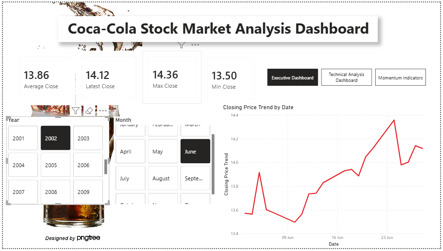
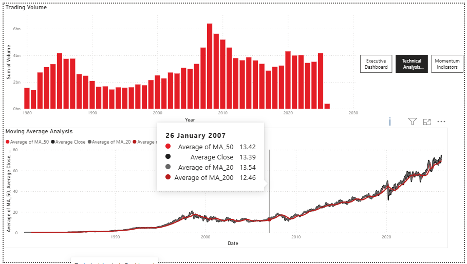
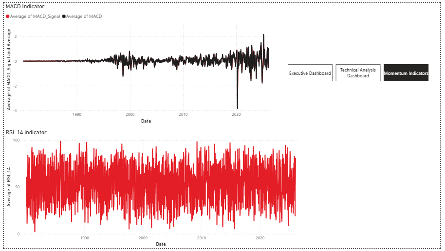

# 📊 Coca-Cola Stock Market Analysis Dashboard (1980–2026)

An interactive Business Intelligence dashboard built using **Microsoft Power BI** to analyze the historical stock performance of **The Coca-Cola Company**. The dashboard combines executive-level insights with technical indicators, enabling users to explore stock trends, trading activity, and market momentum through interactive visualizations.

---

## 📌 Project Overview

The **Coca-Cola Stock Market Analysis Dashboard** provides a comprehensive analysis of Coca-Cola's historical stock data spanning from **1980 to 2026**. The report is designed to support investors, financial analysts, and learners by presenting key performance metrics and technical indicators in a visually intuitive and interactive format.

The dashboard is organized into three dedicated report pages:

- 📄 Executive Dashboard
- 📈 Technical Analysis Dashboard
- 📉 Momentum Indicators Dashboard

Interactive slicers and page navigation allow users to explore stock performance across different years and months.

---

## 🚀 Key Features

### 📄 Executive Dashboard
- Latest Closing Price
- Average Closing Price
- Highest Closing Price
- Lowest Closing Price
- Historical Closing Price Trend
- Interactive Year & Month Slicers
- Page Navigation

---

### 📈 Technical Analysis Dashboard
- Trading Volume Analysis
- 20-Day Moving Average (MA20)
- 50-Day Moving Average (MA50)
- 200-Day Moving Average (MA200)
- Comparative Moving Average Analysis

---

### 📉 Momentum Indicators Dashboard
- MACD (Moving Average Convergence Divergence)
- MACD Signal Line
- Relative Strength Index (RSI)
- Interactive Momentum Analysis

---

## 📊 Dashboard Preview

### 🏠 Executive Dashboard



---

### 📈 Technical Analysis Dashboard



---

### 📉 Momentum Indicators Dashboard



---

## 📂 Dataset

The dashboard uses Coca-Cola's historical stock market dataset containing financial and technical indicators such as:

- Date
- Open Price
- High Price
- Low Price
- Close Price
- Trading Volume
- Daily Return (%)
- Daily Price Range
- EMA (12 & 26)
- Moving Averages (20, 50 & 200)
- MACD
- MACD Signal
- RSI (Relative Strength Index)
- Bollinger Bands

**Dataset Source:** Kaggle

---

## 🛠️ Technologies Used

- Microsoft Power BI Desktop
- Power Query
- DAX (Data Analysis Expressions)
- Data Modeling
- Financial Data Visualization

---

## 📈 Technical Indicators Used

### Moving Averages (MA20, MA50, MA200)
Used to identify short-term, medium-term, and long-term market trends.

### MACD (Moving Average Convergence Divergence)
Measures trend direction and momentum by comparing two exponential moving averages.

### RSI (Relative Strength Index)
Measures market momentum on a scale of 0–100 to identify potential overbought and oversold conditions.

### Trading Volume
Represents the total number of shares traded during a given period and helps validate price movements.

---

## 💡 Key Insights

- Analyze Coca-Cola's historical stock performance over four decades.
- Compare short-, medium-, and long-term market trends.
- Evaluate trading activity through volume analysis.
- Detect bullish and bearish momentum using MACD.
- Monitor overbought and oversold conditions using RSI.
- Interactively filter insights by Year and Month.

---

## 📁 Repository Structure

```
PowerBI-CocaCola-Stock-Market-Analysis/
│
├── Dashboard.pbix
├── Dataset.csv
├── README.md
└── Screenshots/
    ├── Executive_Dashboard.png
    ├── Technical_Analysis.png
    └── Momentum_Indicators.png
```

---

## 🎯 Learning Outcomes

This project demonstrates practical experience in:

- Business Intelligence Reporting
- Interactive Dashboard Design
- Financial Data Analysis
- DAX Calculations
- Data Modeling
- Time-Series Visualization
- Technical Stock Market Analysis

---

## 🔮 Future Enhancements

Potential improvements for future versions include:

- Stock forecasting using machine learning models
- Real-time stock data integration
- Comparative analysis with other companies
- Additional financial indicators and advanced analytics
- Mobile-optimized dashboard layout

---

## 👩‍💻 Author

**Riya Raj Kumari**

---

## ⭐ Support

If you found this project useful or interesting, consider giving the repository a ⭐ on GitHub and also feedbacks!
